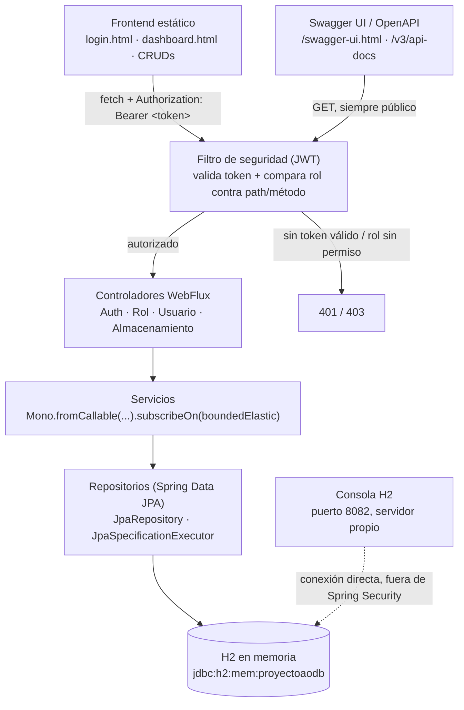

# Proyecto A-O

Microservicio reactivo de demostración: CRUD de roles, usuarios y almacenamiento, con autenticación JWT y
permisos por rol, más un frontend estático mínimo para consumirlo.


---

## Cómo levantar el proyecto

```bash
mvnw spring-boot:run
```

```bash
mvnw test
```

## Accesos

Con el proyecto levantado:

| | URL |
|---|---|
| Frontend · Login | http://localhost:8080/login.html |
| Swagger UI | http://localhost:8080/swagger-ui.html |
| OpenAPI (JSON) | http://localhost:8080/v3/api-docs |
| Consola H2 | http://localhost:8082 |

**Usuario semilla:** `admin` / `Admin123!` (rol `ADMINISTRADOR`, creado automáticamente al arrancar).

**Consola H2:**
- JDBC URL: `jdbc:h2:mem:proyectoaodb`
- Usuario: `sa` · sin contraseña

---

## Arquitectura general

Toda petición pasa por un único filtro que valida el JWT y el rol antes de tocar la lógica de negocio; el
frontend estático y la documentación de Swagger están explícitamente exentos (`permitAll`). La consola H2
corre en su propio servidor sobre el puerto 8082 y habla directo con la misma base de datos, completamente
fuera de esta cadena de seguridad.



---

## Roles y permisos

Solo `ADMINISTRADOR` se siembra automáticamente al arrancar (junto al usuario `admin`). `GERENTE` y `TECNICO`
se crean después, vía la API, usando esa cuenta.

| Recurso |  |  |  |
|---|---|---|---|
| **Roles** | Crear · consultar · editar · eliminar | Solo consultar | _Sin acceso_ |
| **Usuarios** | Crear · consultar · editar · eliminar | Crear · consultar | _Sin acceso_ |
| **Almacenamiento** | Crear · consultar · editar · eliminar | Crear · consultar · editar · eliminar | Crear · consultar |

---

## Flujos clave

**Login y emisión del token**
1. El usuario envía `username` + `password` a `POST /auth/login`.
2. `AuthService` verifica la contraseña (BCrypt) contra el usuario cargado por `UsuarioDetailsService`.
3. Si es válida, `JwtService` firma un token con el username y el rol como claims, vigente 60 minutos.
4. El frontend guarda el token en `localStorage` y lo reenvía en cada request como `Authorization: Bearer`.

**Cada petición protegida**
1. El filtro JWT valida la firma y la expiración del token.
2. Reconstruye el `SecurityContext` con el rol como autoridad (`ROLE_x`).
3. `authorizeExchange` compara ese rol contra la regla del path + método.
4. Si no cumple, corta ahí mismo con 401/403 — el controlador nunca se entera.

---

## Comportamiento de la base de datos

> [!IMPORTANT]
> Se reinicia vacía siempre. Es H2 en memoria: desaparece al detener el proceso. Además, `schema.sql` corre
> `DROP` + `CREATE` en cada arranque, así que aunque no fuera en memoria la estructura se recrearía desde cero
> igual. Al arrancar, `DataSeeder` crea el rol `ADMINISTRADOR` y el usuario `admin` automáticamente; todo lo
> demás (roles, usuarios, registros de almacenamiento) hay que volver a crearlo cada vez, vía la API o el
> frontend.

---

## Endpoints (15 en total)

Agrupados por recurso. La columna de rol es quién puede llamarlo, no quién lo usa normalmente.

**Leyenda de métodos:**


### Auth

| Método | Path | Descripción | Roles |
|---|---|---|---|
|  | `/auth/login` | Autentica y emite el token JWT |  |

### Roles

| Método | Path | Descripción | Roles |
|---|---|---|---|
|  | `/roles` | Crear rol |  |
|  | `/roles/{id}` | Actualizar rol |  |
|  | `/roles/{id}` | Eliminar rol |  |
|  | `/roles` | Listar todos |   |
|  | `/roles/nombre/{nombre}` | Buscar por nombre (coincidencia parcial) |   |

### Usuarios

| Método | Path | Descripción | Roles |
|---|---|---|---|
|  | `/usuarios` | Crear usuario |   |
|  | `/usuarios/{id}` | Actualizar usuario |  |
|  | `/usuarios/{id}` | Eliminar usuario |  |
|  | `/usuarios` | Listar todos |   |
|  | `/usuarios/username/{username}` | Buscar por username (coincidencia parcial) |   |

### Almacenamiento

| Método | Path | Descripción | Roles |
|---|---|---|---|
|  | `/almacenamientos` | Crear registro |    |
|  | `/almacenamientos/{id}` | Actualizar registro |   |
|  | `/almacenamientos/{id}` | Eliminar registro |   |
|  | `/almacenamientos` | Buscar/listar — filtros opcionales: `objetoAlmacenado` (parcial), `fechaIngresoDesde/Hasta`, `fechaSalidaDesde/Hasta` (rango) |    |

### Documentación e infraestructura (públicos)

| Método | Path | Descripción | Roles |
|---|---|---|---|
|  | `/v3/api-docs` | Especificación OpenAPI en JSON |  |
|  | `/swagger-ui.html` | Interfaz interactiva de Swagger |  |
|  | `/`, `/*.html`, `/css/**`, `/js/**` | Frontend estático (login, dashboard, CRUDs) |  |

---

## Convenciones para retomar el proyecto

- **Capas:** todo método de controlador y servicio vive en una interfaz con su propia implementación
  (`controller`/`controller.impl`, `service`/`service.impl`). Los repositorios son la excepción: solo
  interfaces `JpaRepository`, sin implementación propia.
- **DTOs siempre:** las entidades JPA nunca salen del backend tal cual; el mapeo lo hace MapStruct.
- **Inyección de dependencias:** Lombok `@RequiredArgsConstructor` en todas las clases `*Impl`, salvo
  `JwtServiceImpl` (necesita `@Value` por parámetro del constructor).
- **Reactivo + JPA bloqueante:** las llamadas a repositorios van envueltas en
  `Mono.fromCallable(...).subscribeOn(Schedulers.boundedElastic())` para no bloquear los hilos de Netty.
- **Documentación:** Javadoc en clases, interfaces y atributos de DTO/entidad; `{@inheritDoc}` en todo
  método `@Override`.
- **Tests:** `mvnw test` es la fuente de verdad para el backend — 14 tests de integración cubren CRUD,
  autenticación y la matriz de permisos completa. El frontend no tiene tests automatizados; se verificó a
  mano con los 3 roles.

---

## Notas de seguridad

> [!WARNING]
> Antes de subir esto a un repo público o desplegarlo:
> - La contraseña del usuario semilla (`Admin123!`) está en texto plano en `DataSeeder.java`.
> - La clave de firma JWT (`security.jwt.secret`) está en texto plano en `application.properties`.
>
> Ambas deberían moverse a variables de entorno en un despliegue real.

---

<sub>Proyecto demo construido por etapas — base de datos H2 en memoria, sin persistencia real entre reinicios.</sub>
